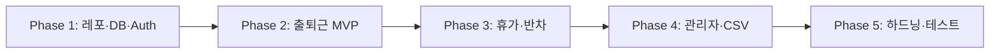

# Plan: 팀원 출퇴근·휴가 통합 웹 시스템 (MVP → 확장)

**기반 리서치**: [.vibe/001_team_attendance_web_system/research.md](./research.md)  
**생성일**: 2026-04-05  
**상태**: DRAFT (미승인 — 구현 금지)  
**승인 여부**: ☐ 미승인  
**리스크 레벨**: Medium (개인정보·근태 데이터, 휴가 도메인 병행)  
**예상 소요 시간**: 6–12 영업일 (1인 기준, 인프라·디자인 범위에 따라 가변)

---

## Plan Metadata

```yaml
version: 1.0
author: AI Assistant
reviewers: []
approval_status: pending
risk_score: 6.0
confidence_level: 0.72
```

**리서치 반영 요약** (research.md 섹션 8 사용자 메모 기준)

- 단일 회사, 이메일·비밀번호 인증, 출퇴근은 **버튼 기반**
- **휴가·반차 통합** (MVP 범위에 포함 — 설계·페이징 필수)
- 단일 타임존(해외 원격 없음), 오프라인/PWA 불필요, 반응형 웹, CSV보내기, 슬랙·팀즈 없음

<!-- MEMO: -->

---

## 0. 목표 & 비목표

### 목표 (Goals)

- [ ] **인증**: 이메일·비밀번호 로그인, 역할 구분(최소 `employee` / `admin` 또는 `manager`)
- [ ] **출퇴근**: 당일 출근·퇴근 기록 생성, 서버 시각 기준, 중복·역전 검증
- [ ] **휴가·반차**: 유형 정의, 신청·승인 흐름, 캘린더/목록 조회, 근태와의 정책 연동(예: 승인된 종일 휴가일 출근 버튼 경고 또는 차단 — **정책은 구현 전 확정**)
- [ ] **본인**: 오늘 상태, 최근 이력, 휴가 신청 내역
- [ ] **관리자**: 팀원 출퇴근·휴가 조회, CSV보내기(기간·팀 필터)
- [ ] **비기능**: HTTPS 배포 전제, 입력 검증(Zod 등), 기본 보안 헤더, 감사 가능한 기록(생성 시각·주체)

### 비목표 (Non-Goals)

- 멀티 테넌트(SaaS), SSO(OAuth), 지오펜스·키오스크, PWA/오프라인
- 슬랙·Microsoft Teams 알림, 전자결재 연동
- 모바일 네이티브 앱
- 복수 타임존·해외 원격 근무 시나리오 (초기 버전)

<!-- MEMO: -->

### 목표 달성 메트릭

| 메트릭 | 현재 값 | 목표 값 | 측정 방법 |
|--------|---------|---------|-----------|
| 분석 대상 코드 파일 | 0 | 핵심 플로우 커버 | 수동 시나리오 + (선택) E2E |
| API p95 (읽기 목록) | — | &lt; 500ms (로컬/스테이징) | 브라우저 DevTools / APM |
| 인증 실패 rate limit | 없음 | 적용 | 미들웨어·프록시 설정 확인 |

---

## 1. 변경 파일 목록

**전제**: 저장소 그린필드 — 아래는 **신규 생성** 위주. 경로는 Next.js App Router + Prisma 관례 예시이며, 승인 시 스택 변경 가능.

### 1.1 신규 파일 (핵심)

| 파일 경로 | 목적 | 예상 라인 | 우선순위 |
|-----------|------|----------|----------|
| `package.json` | 의존성·스크립트 | ~40 | P0 |
| `tsconfig.json` | TS strict | ~25 | P0 |
| `next.config.ts` | Next 설정 | ~20 | P0 |
| `.env.example` | 환경변수 샘플 | ~15 | P0 |
| `prisma/schema.prisma` | DB 스키마 | ~120–200 | P0 |
| `prisma/migrations/*` | 마이그레이션 | 자동 | P0 |
| `src/lib/db.ts` 또는 `lib/prisma.ts` | Prisma 클라이언트 싱글톤 | ~20 | P0 |
| `src/lib/auth.ts` | Auth.js / 세션 설정 | ~80–120 | P0 |
| `src/middleware.ts` | 보호 라우트·rate limit 후킹 | ~40 | P1 |
| `app/layout.tsx`, `app/globals.css` | 루트 레이아웃·토큰 | ~80 | P0 |
| `app/(auth)/login/page.tsx` | 로그인 UI | ~80 | P0 |
| `app/(app)/dashboard/page.tsx` | 직원 대시보드 | ~120 | P0 |
| `app/(app)/attendance/actions.ts` | 출퇴근 서버 액션 | ~80 | P0 |
| `app/(app)/leave/*` | 휴가 신청·목록 | ~200+ | P1 |
| `app/(admin)/**` | 관리자 조회·CSV | ~200+ | P1 |
| `app/api/auth/[...nextauth]/route.ts` | Auth 라우트(스택에 따라) | ~30 | P0 |
| `src/validators/*.ts` | Zod 스키마 | ~100 | P0 |
| `src/types/domain.ts` | 공유 타입 | ~60 | P1 |
| `README.md` | 실행 방법 | ~40 | P2 |

### 1.2 수정 파일

| 파일 경로 | 변경 유형 | 영향도 | 리스크 |
|-----------|----------|--------|--------|
| (해당 없음) | — | — | — |

### 1.3 삭제 파일

| 파일 경로 | 삭제 이유 | 의존성 확인 |
|-----------|----------|------------|
| (해당 없음) | — | — |

<!-- MEMO: -->

---

## 2. 파일별 수정 내용

**그린필드**: 기존 코드 없음. 아래는 **계획된 신규 구현 초안**(승인 후 실제 코드와 다를 수 있음).

### 2.1 `prisma/schema.prisma` (핵심 엔티티 초안)

**변경 전:** (파일 없음)

**변경 후 (계획):**

```prisma
// 의미적 초안 — 마이그레이션 전 리뷰 필수
model User {
  id           String   @id @default(cuid())
  email        String   @unique
  passwordHash String
  name         String
  role         Role     @default(EMPLOYEE)
  teamId       String?
  team         Team?    @relation(fields: [teamId], references: [id])
  attendances  AttendanceRecord[]
  leaveRequests LeaveRequest[]
}

model Team {
  id    String @id @default(cuid())
  name  String
  users User[]
}

model AttendanceRecord {
  id        String   @id @default(cuid())
  userId    String
  user      User     @relation(fields: [userId], references: [id])
  kind      AttendanceKind // CHECK_IN | CHECK_OUT
  at        DateTime @default(now())
  source    String   @default("web")
  @@index([userId, at])
}

model LeaveType {
  id    String @id @default(cuid())
  code  String @unique
  name  String
}

model LeaveRequest {
  id         String      @id @default(cuid())
  userId     String
  user       User        @relation(fields: [userId], references: [id])
  typeId     String
  type       LeaveType   @relation(fields: [typeId], references: [id])
  startDate  DateTime
  endDate    DateTime
  halfDay    HalfDaySlot?
  status     LeaveStatus @default(PENDING)
  reason     String?
  decidedAt  DateTime?
  decidedById String?
}
```

**변경 이유:**

- 리서치 권장 엔티티 + 사용자 확정 사항(단일 조직, 휴가 통합, 버튼 출퇴근) 반영
- 출퇴근 중복 방지는 **부분 유니크 또는 애플리케이션 규칙**(당일 1회 출근 등)으로 구현 — 스키마 단에서 최종 확정 필요

<!-- MEMO: -->

### 2.2 출퇴근 도메인 서비스 (예: `src/lib/attendance-service.ts`)

**변경 전:** (없음)

**변경 후 (계획 시그니처):**

```typescript
// 계획: 서버에서만 호출
export async function recordAttendance(
  userId: string,
  kind: "CHECK_IN" | "CHECK_OUT"
): Promise<{ ok: true } | { ok: false; code: "DUPLICATE" | "NO_CHECK_IN" | "POLICY" }>;
```

**변경 이유:** 서버 시각·정책·휴가와의 충돌을 한 곳에서 판단해 API/서버액션 중복을 줄임.

<!-- MEMO: -->

### 2.3 관리자 CSV (예: `app/(admin)/reports/export/route.ts`)

**계획:** GET 또는 POST로 기간·팀 필터 받아 `text/csv` 스트림 응답. 대량 시 페이지네이션 또는 백그라운드 잡(후속).

<!-- MEMO: -->

---

## 3. 타입/인터페이스 변경

### 3.1 Breaking Changes

- 초기 릴리스 전이므로 **대외 Breaking 없음**. 운영 시작 후 `AttendanceRecord.kind` enum 변경 등은 마이그레이션 문서 필수.

### 3.2 Backward Compatible Changes

- API 응답에 `optional` 필드 추가(예: `clientNote`)는 하위 호환으로 허용.

<!-- MEMO: -->

---

## 4. 구현 전략

### 4.1 구현 순서



### 4.2 Phase별 상세

#### Phase 1: 기초 설정 (1–2일)

- [ ] Next.js + TypeScript + ESLint/Prettier
- [ ] PostgreSQL + Prisma, 초기 마이그레이션
- [ ] Auth(비밀번호 해시 bcrypt/argon2), 세션 또는 JWT **한 가지로 결정** (권장: httpOnly 쿠키 기반 세션)
- [ ] 시드: 관리자 1명, 샘플 팀, LeaveType(연차/반차 등)

#### Phase 2: 출퇴근 MVP (1–2일)

- [ ] 직원 대시보드: 오늘 상태, 출근/퇴근 버튼
- [ ] 서버 액션/API + Zod 검증 + 중복 방지
- [ ] 본인 이력 페이지(페이지네이션)

#### Phase 3: 휴가·반차 (2–3일)

- [ ] 신청 폼, 본인 목록, 관리자 승인/거절
- [ ] 반차: `HalfDaySlot` AM/PM 모델링
- [ ] 출퇴근과의 **정책**(휴가일 버튼 허용 여부) 구현 및 UI 메시지

#### Phase 4: 관리자·CSV (1–2일)

- [ ] 팀·기간 필터, 표 뷰
- [ ] CSV 다운로드(출퇴근 + 휴가 병합 또는 탭 분리 — **승인 시 선택**)

#### Phase 5: 하드닝·테스트 (1–2일)

- [ ] Rate limiting(로그인·출퇴근 POST)
- [ ] 보안 헤더, 환경분리
- [ ] 유닛(도메인 규칙) + 핵심 E2E 1–3개

<!-- MEMO: -->

---

## 5. 마이그레이션 & 호환성

### 5.1 마이그레이션 전략

- **Approach**: Phased (로컬 → 스테이징 → 프로덕션)
- **Timeline**: 기능별 PR 단위 마이그레이션
- **Rollback Point**: 각 마이그레이션 직전 DB 백업 + `prisma migrate resolve` 절차 문서화

### 5.2 호환성 매트릭스 (계획)

| 시스템 | 목표 버전 | 비고 |
|--------|-----------|------|
| Node.js | 20 LTS | 팀 표준에 맞게 조정 |
| PostgreSQL | 15+ | |
| Next.js | 15.x (또는 팀 고정) | |

### 5.3 Breaking Change 공지

- 운영 이후 스키마 변경 시 `CHANGELOG.md` + 관리자 공지.

<!-- MEMO: -->

---

## 6. 테스트 전략

### 6.1 테스트 범위

| 테스트 유형 | 현재 | 목표 | 비고 |
|------------|------|------|------|
| Unit | 0% | 도메인 규칙 핵심 경로 | 출퇴근 중복, 휴가일 충돌 |
| Integration | 0% | API/서버액션 + 테스트 DB | |
| E2E | 0% | 로그인→출근→퇴근, 휴가 승인 | Playwright 권장 |

### 6.2 핵심 시나리오

1. **Happy Path**: 로그인 → 출근 → 퇴근 → 이력 표시
2. **Error**: 동일일 이중 출근, 퇴근만 시도, 잘못된 로그인
3. **Edge**: 승인된 종일 휴가일 출근 시도(정책에 따른 거부/경고)
4. **권한**: 일반 직원이 관리자 API 호출 시 403

### 6.3 테스트 자동화 (목표)

```yaml
ci-pipeline:
  - lint
  - type-check
  - unit-tests
  - prisma migrate deploy (스테이징만)
  - e2e (선택, 스테이징)
```

<!-- MEMO: -->

---

## 6.5 UI/UX Design Quality

프론트엔드(`.tsx`, `.css`) 신규 포함 → 본 섹션 활성화.

### Design Decisions

| 항목 | 선택 | 근거 |
|------|------|------|
| Typography | 시스템 폰트 스택 + 한글 가독성 우선 (예: 맑은 고딕/Apple SD) 또는 **프리텐다드** 1종만 | 과도한 웹폰트 로딩 회피 |
| Color System | OKLCH 기반 1 primary + 중립 그레이, WCAG AA 대비 | 업무용 툴 — 장시간 피로 완화 |
| Layout | 좌측 네비 또는 상단 탭 + 콘텐츠 최대폭 제한(예: 72ch) | 반응형 단일 컬럼 우선 |
| Motion | `prefers-reduced-motion` 존중, transition 150–200ms opacity/transform만 | 성능·접근성 |
| Spacing | 4px 기준 스케일(4/8/12/16/24) | 일관된 폼·버튼 |

### AI-Pattern Avoidance Checklist

- [ ] Inter/Roboto 남발 대신 **1 패밀리** 또는 시스템 스택
- [ ] cyan-on-dark / 보라 그라데이션 히어로 **회피**
- [ ] 카드 중첩·전부 center 정렬 **회피** — 업무 대시보드는 정렬·표 우선
- [ ] glassmorphism·장식용 차트 **회피**
- [ ] 모든 버튼 primary **회피** — 출근/퇴근만 시각적 강조
- [ ] 모바일에서 핵심 액션 숨김 **회피**

<!-- MEMO: -->

---

## 7. 롤백 전략

### 7.1 롤백 트리거

- [ ] 프로덕션 로그인 실패율 급증
- [ ] 출퇴근 기록 중복·누락 버그 확인
- [ ] 마이그레이션 실패 또는 데이터 불일치

### 7.2 롤백 절차

- 배포: 이전 이미지/커밋 재배포
- DB: 마이그레이션 **down** 또는 백업 복원(운영 전략에 따름)
- Git: `git revert` 범위 명시

### 7.3 롤백 복잡도: **Medium**

- 데이터베이스 변경: **있음** (Prisma 마이그레이션)
- 외부 API: 없음(초기)
- 설정: 환경변수(시크릿 회전 포함)

<!-- MEMO: -->

---

## 8. 대안 & 트레이드오프

### 대안 A: 별도 BFF (Nest/FastAPI) + React SPA

- **장점**: API·프론트 독립 배포
- **단점**: 초기 인력·인프라 비용 증가
- **선택 안 한 이유**: 단일 조직 MVP는 풀스택 Next 단일 레포가 faster time-to-value

### 대안 B: SQLite + 단일 서버

- **장점**: 로컬·소규모 즉시 실행
- **단점**: 동시 쓰기·백업 정책에서 PostgreSQL 대비 제약
- **선택 안 한 이유**: 리서치에서 PostgreSQL 권장, 근태·감사에 유리

### 트레이드오프 요약

| 요소 | 채택안 (Next+Prisma+PG) | SPA+BFF |
|------|-------------------------|---------|
| 초기 속도 | 높음 | 중간 |
| 분리 확장성 | 중간 | 높음 |

<!-- MEMO: -->

---

## 9. 리스크 분석

### 9.1 리스크 매트릭스

| 리스크 | 확률 | 영향도 | 레벨 | 완화 전략 |
|--------|------|--------|------|----------|
| 휴가·근태 정책 모호로 인한 재작업 | Medium | High | High | Phase 3 착수 전 **정책 표 1장** 합의 |
| 대리 출퇴근 | Medium | High | High | 감사 로그, (선택) IP 기록, 교육·정책 |
| 인증 공격 | Low | Critical | Medium | rate limit, bcrypt cost, HTTPS |
| CSV 대량 조회 성능 | Medium | Medium | Medium | 인덱스, 기간 제한, 페이지네이션 |

### 9.2 리스크 점수 (내부 가중)

- 총괄: **Medium (약 6/10)** — 완화 전략 수립 시 수용 가능

### 9.3 컨틴전시 플랜

1. **Plan A**: 상기 Phase 순서대로 전 기능
2. **Plan B**: 휴가는 “조회만 + 수동 승인 없이 관리자 입력”으로 단순화
3. **Plan C**: 출퇴근만 먼저 배포, 휴가는 v1.1

<!-- MEMO: -->

---

## 10. 핵심 의사결정 질문

### 필수 결정 사항

- [ ] **Q1**: 세션 저장소 — DB 세션 vs JWT(짧은 만료)+refresh?  
  - **권장 초안**: httpOnly 쿠키 + 서버 세션(또는 Auth.js 기본)

- [ ] **Q2**: 휴가일 출근 버튼 — **차단** vs **경고 후 허용** vs **허용만**?  
  - **경고 후 허용**: [결정 대기 — 노무 실무와 합의] 

- [ ] **Q3**: 반차일 근태 — 반차 PM만 출근 버튼 오전 비활성화 등 **세분 규칙**?  
  - **경고 후 허용**: [결정 대기]

- [ ] **Q4**: 조직 모델 — `Organization` 단일 행 고정 vs 테이블 유지(향후 확장)?  
  - **권장**: 테이블 유지 + 시드 1행 (비용 낮음)

### 선택적 고려

- [ ] 감사 로그 별도 테이블 vs 이벤트 스트림(후자는 후순위)
- [ ] 관리자 CSV: UTF-8 BOM 여부(엑셀 한글)

<!-- MEMO: -->

---

## 11. AI Review Report

### 11.1 자동 평가 결과

| 평가 항목 | 점수 | 근거 |
|-----------|------|------|
| 목표 명확성 | 10 | research 메모 반영, 비목표 명시 |
| 파일 변경 완성도 | 10 | 그린필드 신규 목록 구체화 |
| 코드 변경 상세도 | 7 | 기존 Before 없음; Prisma·시그니처 초안만 |
| 타입 안전성 | 8 | enum·정책은 구현 전 확정 필요 |
| 구현 순서 | 10 | Phase 의존성 타당 |
| 테스트 전략 | 8 | E2E·CI는 선택 표기 |
| 롤백 전략 | 8 | DB 있어 Medium 복잡도 명시 |
| 리스크 분석 | 9 | 정책 리스크 인지 |
| 보안 고려 | 8 | rate limit·헤더·쿠키 언급 |
| 의사결정 완료 | 5 | Q2/Q3 미결 |

**완성도 합산: 약 83/100**

### 11.2 개선 제안

1. **휴가·근태 정책**을 1페이지로 고정하면 재작업 리스크 대폭 감소. Y
2. 로그인·출퇴근 POST에 **rate limit** 수치 목표 명시(예: IP당 분당 N회). Y
3. 프로덕션 **백업 주기**·복구 RPO/RTO 한 줄이라도 README에 명시.  필요없슴슴

### 11.3 대안 접근법

- 휴가를 처음부터 **캘린더 서드파티**와 동기화하지 않고 자체 DB만 쓰는 현재 방향이 MVP에 유리. 이후 ICS보내기로 확장 가능.

---

## 승인 체크리스트

### 기술 검토

- [ ] research.md 최신화 완료 (섹션 8 메모 반영)
- [ ] 목표/비목표 명시 완료
- [ ] 변경 파일 경로 합의
- [ ] 휴가·근태 정책(Q2/Q3) 합의
- [ ] 테스트 전략 합의
- [ ] 롤백 전략 합의

### 비즈니스 검토

- [ ] CSV 필드·보존 기간 요구 반영
- [ ] 일정·인력 현실적

### AI 검토

- [ ] 자동 리뷰 80점 이상 — **현재 ~83 (조건부 통과)**
- [ ] 리스크 Medium 수용 여부
- [ ] 핵심 의사결정(Q2/Q3) 응답

### 최종 승인

- [ ] 기술 리드 승인: ☐
- [ ] 프로덕트 오너 승인: ☐
- [ ] 개발자 최종 승인: ☐

**승인 시각**: 10:52 
**승인자**: baram
**승인 코멘트**: Go

---

## 실행 명령

승인 완료 후:

```text
/vibe-implement --plan 001_team_attendance_web_system
```

미승인 상태에서는 구현을 시작하지 않는다.

---

## 버전 히스토리

- v1.0 (2026-04-05): research.md 기반 초안, 그린필드 Next+Prisma+PostgreSQL 가정, 휴가 통합 Phase 포함
