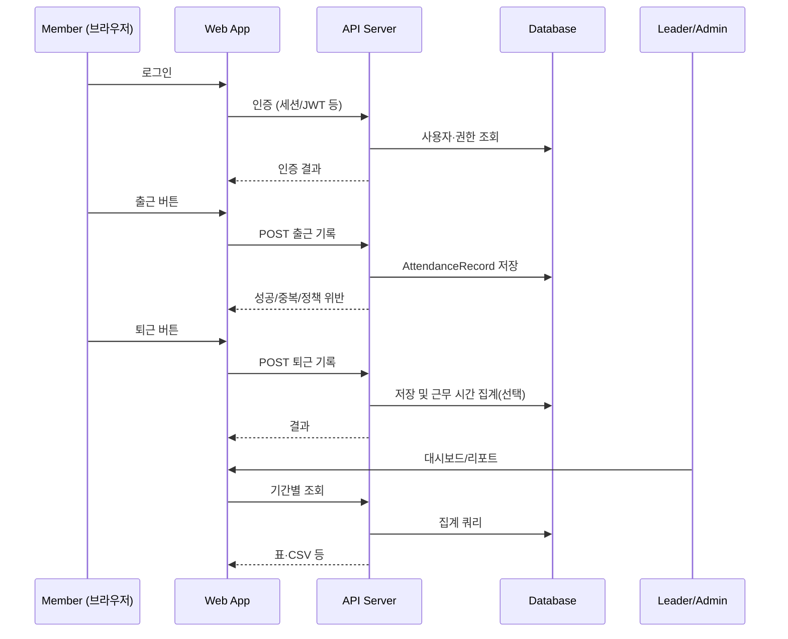
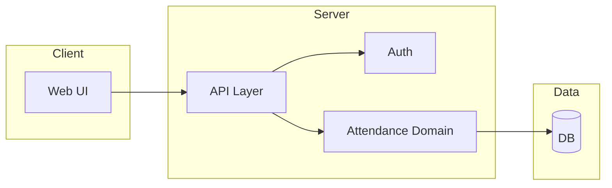

# Research: 팀원 출퇴근 관리 웹 시스템 (Team attendance web system)

**생성일**: 2026-04-05  
**인덱스**: 001  
**상태**: research-only (코드 변경 없음)  
**분석 모드**: 기본 (코드베이스 스캔 + 도메인·아키텍처 조사)  
**태그**: #attendance #web #greenfield #hr #time-tracking

---

## 리서치를 시작할 때의 선언

**주제**: 팀원 출퇴근(체크인/체크아웃) 관리 웹 시스템 구축을 위한 사전 분석  
**산출물**: `.vibe/001_team_attendance_web_system/research.md`

**자동 감지된 분석 모드** (요청 문구 기준):

- [x] 기본 분석 (범위 파악, 플로우·데이터·의존성 관점의 설계 전제)
- [ ] `--deep`: 미활성화 (성능·프로파일 키워드 없음)
- [ ] `--patterns`: 미활성화 (리팩토링·중복 키워드 없음)
- [ ] `--graph`: 미활성화 (의존성·모듈 구조 키워드 없음 — 아래 그래프는 **목표 시스템 개념도**로만 제시)

**감지된 키워드**: 팀원, 출퇴근, 관리, 웹, 시스템  
**활성화된 옵션**: 기본 분석만

---

## 🔗 관련 리서치

- (없음) 동일 저장소 내 선행 `.vibe/*/research.md` 없음.

---

## 0. 코드베이스 현황 (실측)

| 항목 | 결과 |
|------|------|
| 측정 방법 | `Get-ChildItem -LiteralPath "d:\Cursor\Test1\team-attendance" -Force` (2026-04-05) |
| 루트 하위 항목 | **없음** (빈 디렉터리) |
| 애플리케이션 소스 | **없음** |
| 패키지 매니페스트 (`package.json`, `pyproject.toml` 등) | **없음** |

**결론**: 현재 워크스페이스는 **그린필드** 상태이다. 이하 **섹션 1의 파일·함수·타입 맵**에 적을 애플리케이션 코드 경로는 존재하지 않는다. 도메인 요구사항·일반적인 웹 시스템 구조·리스크는 **설계 조사**로 기술하며, 구현 후에는 동일 토픽에 후속 리서치로 코드 맵을 채울 수 있다.

---

## 1. 관련 파일/함수/타입 맵

### 1.1 핵심 파일

| 파일 경로 | 역할 | 복잡도 | 변경 위험도 |
|-----------|------|--------|-------------|
| (해당 없음) | 저장소에 소스 파일 없음 | — | — |

### 1.2 타입 정의

- **해당 없음** (TypeScript/기타 언어 타입 정의 파일 없음)

### 1.3 권장 도메인 엔티티 (구현 전 설계 후보 — 코드와 무관)

출퇴근 관리에 자주 등장하는 개념 모델(이름은 프로젝트 컨벤션에 맞게 조정 가능):

| 개념 | 설명 | 일반적 속성 예 |
|------|------|----------------|
| `Organization` / `Tenant` | 회사 또는 독립 운영 단위 | id, name |
| `Team` | 팀 단위 | id, name, orgId |
| `Member` / `User` | 로그인 주체·직원 | id, email, teamId, role |
| `AttendanceRecord` | 출근/퇴근 이벤트 | id, userId, type(in/out), timestamp, source(web/gps/manual), note |
| `WorkSchedule` (선택) | 근무 제도·유연근무 | 요일별 기대 시간, 타임존 |
| `CorrectionRequest` (선택) | 정정 신청 | 원본 기록, 요청 사유, 승인 상태 |

---

## 2. 현재 동작 플로우

**실제 제품 플로우**: 코드 없음 → **없음**.

**목표 시스템으로 가정한 대표 플로우** (시퀀스 — 구현 선택에 따라 달라질 수 있음):



---

## 3. 데이터 플로우

### 3.1 입력 데이터

| 소스 | 내용 | 검증 포인트 |
|------|------|-------------|
| 로그인 폼 | 식별자(이메일 등), 비밀번호 또는 SSO | 자격 증명, rate limit |
| 출퇴근 액션 | 이벤트 타입, 클라이언트 시각(참고), 타임존 | 서버 시각 우선 정책 여부, 중복 클릭 |
| (선택) 위치 | GPS 좌표 | 개인정보·동의, 정확도 |
| 관리자 입력 | 정정 승인, 팀 구성 | 권한(RBAC) |

### 3.2 상태 관리 (웹 클라이언트 관점 — 기술 미선정)

- **인증 토큰/세션**: httpOnly 쿠키 vs localStorage(보안 트레이드오프) — **결정 필요**
- **UI 상태**: 서버 상태(React Query/SWR 등) vs 전역 스토어 — 스택 선택 후 확정

### 3.3 출력

- 사용자: 당일 상태, 이력 목록, (선택) 알림
- 관리자: 팀/기간별 집계,보내기(CSV/Excel), 감사 로그(권장)

---

## 4. 의존성 & 사이드이펙트

### 4.1 의존성 그래프 (코드 import — **해당 없음**)

코드가 없으므로 import 그래프는 생략. **목표 아키텍처 개념 그래프**만 제시:



### 4.2 사이드이펙트 (설계 시 예상)

- DB 쓰기: 모든 출퇴근 기록
- 이메일/푸시(선택): 리마인더, 이상 근태 알림
- 감사: 관리자 조작·정정 이력 보관(규정 대응)

---

## 5. 코드 패턴 분석 (`--patterns` 미적용)

- **스캔 대상 없음**: TypeScript/JavaScript 등 애플리케이션 소스 0건.
- 구현 단계에서 권장 점검(선행 기준):
  - `console.log` 프로덕션 잔존
  - `any` 남용
  - API 경계에서 Zod 등으로 입력 검증 일관성

---

## 6. 성능 분석 (`--deep` 미적용)

- **측정 대상 없음**.
- 출퇴근 도메인에서 흔한 이슈(구현 시 참고):
  - 기간별 **대량 조회 + 집계** → 인덱스(`user_id`, `date`), 페이지네이션, 배치 리포트
  - 동시에 같은 사용자가 출근을 여러 번 누르는 **중복 요청** → idempotency 키 또는 DB 유니크 제약

---

## 7. 리스크 & 파급 범위

### 7.1 보안·프라이버시

| 리스크 | 심각도 | 영향 | 완화 방향 |
|--------|--------|------|-----------|
| 타인 대리 출퇴근 | High | 근태 신뢰도 | 기기 바인딩, IP/위치(동의), 관리자 모니터링 |
| 인증 우회 | High | 전체 | 표준 인증, HTTPS, 세션/토큰 하드닝 |
| 개인정보 유출 | High | 법적 | 최소 수집, 암호화, 접근 로그 |
| 권한 상승 | Medium | 데이터 변조 | RBAC, 서버 측 재검증 |

### 7.2 규정·노무 (지역 의존 — 확인 필요)

- 근로기준법·근태 기록 보존 기간 등은 **국가/회사 정책**에 따름. 제품 요구사항에 “보존 기간·정정 절차·동의”를 명문화할 것.

### 7.3 변경 파급 (그린필드 기준 예상)

- 인증 방식 변경 → 전 클라이언트·API
- `AttendanceRecord` 스키마 변경 → 마이그레이션, 리포트 쿼리

---

## 8. 불확실성 & 확인 필요 항목

### 필수 확인

- [ ] **단일 회사** vs **멀티 테넌트(SaaS)**? 단일회사
- [ ] **인증**: 이메일/비번만 vs **SSO**(Google, Microsoft)? 비번
- [ ] **출퇴근 판정**: 버튼만 vs **지오펜스** vs **키오스크/단말** 연동? 버튼
- [ ] **휴가·반차** 등과 통합할지, MVP는 출퇴근만 할지? 통합
- [ ] **타임존**: 해외 원격 포함 여부? N
- [ ] **오프라인** 필요 여부(PWA 등)? N

### 선택 확인

- [ ] 모바일 네이티브 앱 vs 반응형 웹만? 반응형
- [ ] 슬랙/팀즈 알림 연동? N
- [ ] CSV 다운로드만 vs 전자결재 연동? CSV

---

## 9. 기술 스택 후보 (결정 전 — 코드베이스와 무관)

| 층 | 옵션 예 | 비고 |
|----|---------|------|
| 프론트 | React/Next.js, Vue/Nuxt, SvelteKit | SSR 여부는 SEO·로그인 플로우에 영향 |
| API | 동일 모노리스(Next API Routes) vs 별도 Nest/FastAPI/Go | 팀 역량·배포 모델 |
| DB | PostgreSQL 권장(관계형·감사에 유리), SQLite는 소규모 데모 | |
| 인증 | NextAuth, Auth.js, Cognito, Clerk 등 | 개인정보·비용 |

**불확실성**: 위는 일반론이며, 사용자의 인프라·예산·팀 스킬에 따라 확정 필요.

---

## 10. 메트릭스 & 통계

```yaml
분석 범위 (실측):
  애플리케이션 파일 수: 0
  총 코드 라인(앱): 0
  함수/타입 정의: 0

코드 품질:
  ESLint/TypeScript strict: 해당 없음
  테스트: 해당 없음

리서치 산출:
  토픽 폴더: .vibe/001_team_attendance_web_system/
  문서: research.md (본 파일)
```

---

## 11. 요약 & 다음 단계

### 핵심 발견

1. 저장소는 **빈 그린필드**이므로, 구현 전 **요구사항·역할·규정**을 먼저 고정하는 것이 리스크를 줄인다.
2. 출퇴근 시스템의 핵심은 **신뢰 가능한 기록(감사)·권한·개인정보**이다.
3. 코드 레벨 맵·패턴·성능 분석은 **첫 커밋 이후** 동일 토픽 또는 `002_...`로 재수행하는 것이 적절하다.

### 즉시 조치 (제품 기획 관점)

- MVP 범위: 예) “웹 로그인 + 출근/퇴근 버튼 + 본인 이력 조회 + 관리자 팀 조회”
- 비기능: HTTPS, 비밀번호 정책 또는 SSO, 기본 감사 로그

### 다음 단계

- **`/vibe-plan`**: 스택 확정, ERD, API 초안, 화면 목록, 마일스톤
- 구현 시작 후: 핵심 모듈에 대해 **코드 기반** 리서치 갱신 (`파일경로:라인` 형식으로 맵 재작성)

---

## 태그

#attendance #web #greenfield #planning #security #privacy

## 버전 히스토리

- v1.0 (2026-04-05): 워크스페이스 실측(빈 저장소) 및 출퇴근 웹 시스템 도메인·리스크 조사 초안
