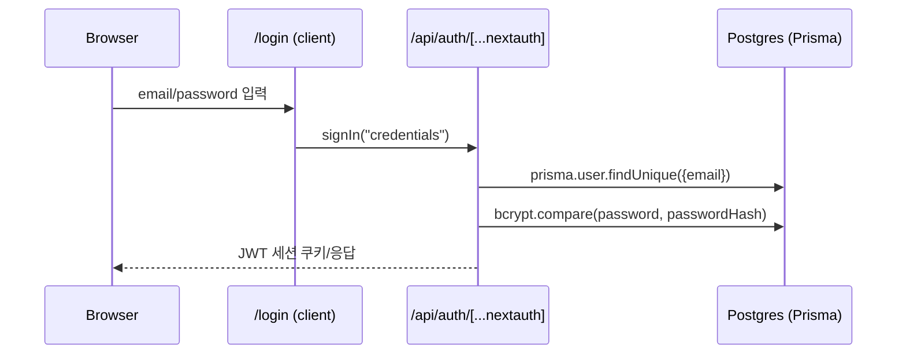
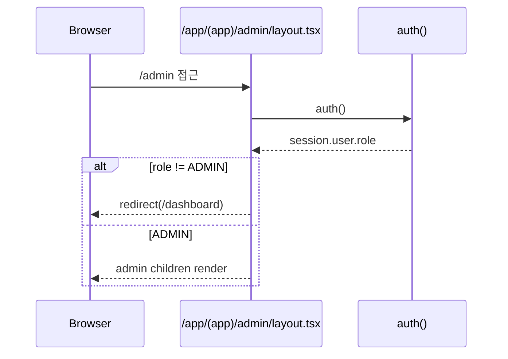

# Research: Admin user creation (관리자 사용자 추가)

**생성일**: 2026-04-07
**인덱스**: 002
**상태**: research-only (코드 변경 없음)
**분석 모드**: 기본 + patterns + graph
**태그**: #admin #users #auth #prisma #nextjs #authjs

---

## 0. 목표 정의 (요구사항을 코드로 번역)

요청: **“관리자가 사용자를 추가할 수 있도록”**

현재 시스템의 인증 방식은 **Credentials(email/password) + DB(User.passwordHash) + JWT 세션(role 포함)** 이므로, “사용자 추가”는 최소한 아래를 충족해야 함:

- **DB(User) 레코드 생성**: `email`, `name`, `passwordHash`, `role`, `teamId?`
- **비밀번호 해싱**: 로그인 검증은 `bcrypt.compare(plaintext, user.passwordHash)` 기반
- **권한 보호**: ADMIN만 접근/실행 가능
- **UX**: 관리자 화면에서 추가 폼 + 성공/실패 메시지

---

## 1. 관련 파일/함수/타입 맵

### 1.1 핵심 파일(현재 존재)

| 파일 경로 | 역할 | 비고 |
|---|---|---|
| `prisma/schema.prisma:38-51` | `User` 모델 정의 | 생성 시 필수 필드 확인 |
| `src/auth.ts:1-57` | Auth.js 설정 + credential authorize | 로그인 시 DB 조회/비교 |
| `src/lib/db.ts:1-9` | PrismaClient 싱글톤 | 모든 DB 접근의 엔트리 |
| `src/app/(app)/layout.tsx:1-23` | (app) 그룹 인증 가드 | 로그인 없으면 `/login` |
| `src/components/app-shell.tsx:6-55` | 상단 네비/관리 메뉴 노출 | `role === "ADMIN"` 일 때 `/admin` 링크 |
| `src/app/(app)/admin/layout.tsx:1-14` | Admin 섹션 권한 가드 | `role !== "ADMIN"`이면 `/dashboard`로 리다이렉트 |
| `src/app/(app)/admin/page.tsx:5-155` | 관리자 메인 화면 | 휴가 승인 + 최근 출퇴근 + CSV |
| `src/app/(app)/leave/actions.ts:84-105` | 관리자 권한 server action 예시 | `session.user.role !== "ADMIN"` 체크 패턴 |

### 1.2 타입/권한 신뢰 경로

- **세션(role) 주입**: `src/auth.ts:47-56`
  - `jwt()`에서 `token.role` 설정
  - `session()`에서 `session.user.role` 설정
- **Admin 가드**:
  - UI 네비 노출: `src/components/app-shell.tsx:29-33`
  - 라우트 가드: `src/app/(app)/admin/layout.tsx:9-12`

---

## 2. 현재 동작 플로우 (인증/권한)

### 2.1 로그인 플로우 (Credentials)



근거 코드:
- 로그인 폼: `src/app/login/login-form.tsx:12-27`
- authorize: `src/auth.ts:24-43` (DB 조회 + bcrypt 비교)

### 2.2 관리자 권한 플로우



근거 코드:
- `src/app/(app)/admin/layout.tsx:9-13`

---

## 3. 데이터 모델 분석 (User 생성 시 필수/제약)

`User` 모델은 다음을 강제:

- `email`: `@unique` (`prisma/schema.prisma:40`)
- `passwordHash`: 필수 (`prisma/schema.prisma:41`)
- `name`: 필수 (`prisma/schema.prisma:42`)
- `role`: 기본 EMPLOYEE (`prisma/schema.prisma:43`)
- `teamId`: optional (`prisma/schema.prisma:44-45`)

즉, “관리자 사용자 추가” 폼/액션은 최소 입력으로도 `email/name/password`는 반드시 필요.

---

## 4. 구현 지점 후보(아키텍처 선택지)

### 4.1 UI 라우트(관리자 화면)

현재 admin 영역은 `/admin` 하나뿐 (`src/app/(app)/admin/page.tsx`).

사용자 추가를 붙이는 방식은 2가지가 자연스러움:

1) **`/admin` 내부에 “사용자 추가” 섹션 추가**
- 장점: 파일/라우트 추가 적음
- 단점: admin page가 더 비대해짐

2) **`/admin/users` + `/admin/users/new` 형태로 분리**
- 장점: 확장성 좋음(목록/검색/수정/비활성화 등)
- 단점: 라우트/컴포넌트 증가

현재 코드 스타일(leave/new 폴더 구조)로 보면 2)로 가는 것이 일관적:
- 예시 구조: `src/app/(app)/leave/new/page.tsx`, `new-leave-form.tsx`

### 4.2 서버 처리(생성 API/액션)

현재 DB 쓰기는 두 패턴이 있음:

- **server action (`"use server"`)**: `src/app/(app)/leave/actions.ts`, `src/app/(app)/dashboard/actions.ts`
- **route handler (`route.ts`)**: 현재는 export/callback 중심 (`src/app/(app)/admin/export/route.ts`, `src/app/api/auth/[...nextauth]/route.ts`)

“관리자 사용자 추가”는 폼 기반이므로, 기존 패턴을 따라 **server action**이 가장 간단:
- 권한 체크: `decideLeaveAction` 참고 (`src/app/(app)/leave/actions.ts:88-91`)
- 성공 후 revalidate/redirect: leave action 패턴 참고 (`src/app/(app)/leave/actions.ts:79-82`, `102-105`)

---

## 5. 코드 패턴 분석 (--patterns)

### 5.1 권한 체크 패턴(재사용 후보)

ADMIN 권한 체크는 최소 2곳에서 중복 패턴:
- 라우트 레벨 가드: `src/app/(app)/admin/layout.tsx:9-12`
- 액션 레벨 가드: `src/app/(app)/leave/actions.ts:88-91`

“사용자 추가”도 **액션 레벨에서 반드시 2중 방어**가 필요:
- UI에서 admin 메뉴가 보여도, 요청 위조 방지 위해 서버에서 체크 필수

### 5.2 입력 검증 패턴(재사용 후보)

휴가 신청은 zod schema를 사용:
- `src/app/(app)/leave/actions.ts:6,26-32` (+ `src/validators/leave.ts`)

반면 로그인은 zod를 직접 정의(`credentialsSchema`)하고, `src/validators/auth.ts`의 `loginSchema`는 현재 로그인 흐름에서 직접 쓰이지 않음:
- loginSchema: `src/validators/auth.ts:3-6`
- authorize schema: `src/auth.ts:8-11`

“사용자 추가”를 추가할 때는 zod schema를 `src/validators/`에 두고 액션에서 parse하는 패턴이 일관적.

### 5.3 비밀번호 해싱/검증 패턴

- 검증: `src/auth.ts:36-38`의 `bcrypt.compare`
- 시드 생성: (프로젝트에 존재) `prisma/seed.ts`에서 `bcrypt.hash(..., 12)`를 사용해 `passwordHash` 생성 (해싱 라운드 12)

“사용자 추가”에서도 동일하게 `bcrypt.hash(plain, 12)` 필요.

---

## 6. 의존성 그래프 (--graph)

### 6.1 인증/권한 의존성

```mermaid
graph TD
  A[src/app/(app)/admin/layout.tsx] --> B[src/auth.ts]
  A --> C[src/lib/db.ts]
  B --> C
  C --> D[@prisma/client]

  E[src/components/app-shell.tsx] --> F[next-auth/react]
  E --> G[/admin link]
```

### 6.2 “사용자 추가” 예상 의존성(추가 시)

```mermaid
graph TD
  UI[admin users form page] --> Action[createUserAction]
  Action --> Auth[auth()]
  Action --> Prisma[src/lib/db.ts]
  Action --> Zod[src/validators/user.ts (new)]
  Action --> Bcrypt[bcryptjs]
  Action --> Revalidate[revalidatePath/redirect]
```

---

## 7. 리스크 & 파급 범위

### 7.1 보안/운영 리스크

- **초기 비밀번호 배포**: 관리자가 직접 비밀번호를 입력하게 할지, 랜덤 생성 후 사용자에게 전달할지 결정 필요
- **비밀번호 정책**: 현재 로그인은 `min(1)` 수준 (`src/auth.ts:10`)이라 정책 강화 필요 가능
- **중복 이메일 처리**: `email @unique`이므로 사용자 생성 시 충돌 메시지/UX 필요
- **권한 상승 방지**: role 입력을 허용하면 ADMIN 생성 가능 → 별도 정책 필요(예: ADMIN은 ADMIN만 만들 수 있게, 혹은 UI에서 제한)

### 7.2 기능 파급 범위

User 생성은 아래 기능에 연쇄 영향:
- 로그인: 새 계정으로 로그인 가능해야 함 (`src/auth.ts:31-39`)
- 팀 필터/표시: admin 화면에서 team 표시/필터가 있으므로, 새 사용자의 teamId가 의미 있게 연결되어야 함 (`src/app/(app)/admin/page.tsx:13-17, 96-100`)

---

## 8. 불확실성 & 확인 필요 항목

필수:
- [ ] **사용자 추가 시 입력 필드**: (email/name/password/team/role) 중 어디까지 노출?
- [ ] **초기 비밀번호 처리 방식**: 관리자 입력 vs 랜덤 생성 vs 초대 링크/비번 재설정
- [ ] **팀 관리 범위**: 팀도 관리자 화면에서 생성/수정할 필요가 있는지?

선택:
- [ ] 사용자 비활성화(soft delete) 필요 여부
- [ ] 비밀번호 변경/재설정 UI 필요 여부
- [ ] 이메일 인증/초대 방식 필요 여부

---

## 9. 다음 단계 제안 (plan으로 넘어가기 전)

아래 2단계로 진행하는 것이 리스크/범위 측면에서 안전:

1) **MVP: 관리자 사용자 “생성”만**
   - 최소 입력: email, name, password, (team 선택), role은 기본 EMPLOYEE
2) **운영 기능 추가**
   - 사용자 목록/검색, role 변경(정책 동반), 비밀번호 재설정, 팀 관리

